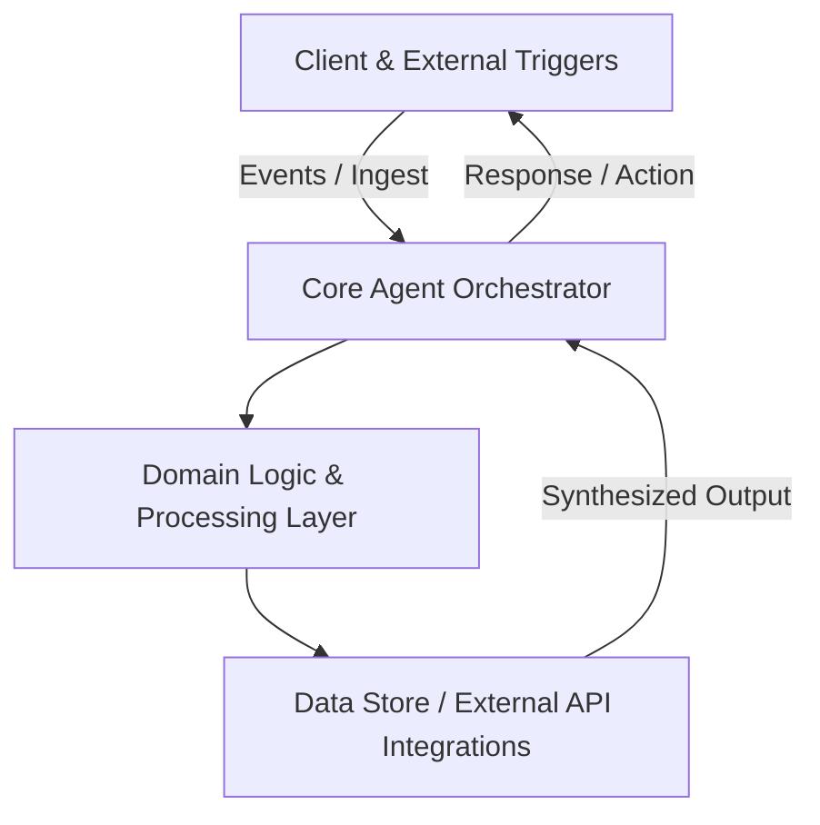

<div align="center">

# 🚀 Orbiteus Ai Business Engine

**AI agent platform that automatically generates custom business software, ERP workflows, and CRM modules from natural language specs.**

     
[](LICENSE)

<p align="center">
  AI agent platform that automatically generates custom business software, ERP workflows, and CRM modules from natural language specs.
</p>

</div>

---

## 🌟 Key Highlights & Architectural Features

- **⚡ Modern Architecture**: Engineered using TypeScript, React, Node.js, GraphQL.
- **🎯 Core Domain Capability**: AI agent platform that automatically generates custom business software, ERP workflows, and CRM modules from natural language specs.
- **🔒 Production-Ready & Modular**: Strict separation of concerns, robust error handling, and high-performance throughput.
- **📈 Scalable & Maintainable**: Built following modern enterprise standards with full CI/CD verification.

---

## 🏗️ System Architecture & Workflow



| Layer | Primary Technologies | Role |
| :--- | :--- | :--- |
| **Frontend / Interface** | TypeScript | Interactive interface, state management, and real-time events |
| **Agent / Processing Engine** | React | Core autonomous reasoning, tool dispatching, and orchestration |
| **Data & Services** | Node.js | Persistence, vector indexing, caching, and external webhooks |

---

## 🚀 Quick Start Guide

### 1. Clone & Setup
```bash
git clone https://github.com/the-forgotten-polymath/orbiteus-ai-business-engine.git
cd orbiteus-ai-business-engine
```

### 2. Launch
Refer to repository package specifications to run locally.

---

## 📄 License

This project is licensed under the **MIT License**.
